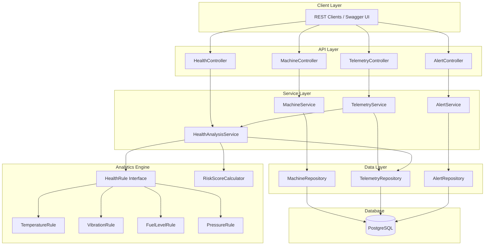

# FleetPulse - Industrial Equipment Monitoring and Predictive Maintenance Platform

## 1. Project Overview
FleetPulse is a production-quality backend platform designed for monitoring industrial equipment health. It ingests machine telemetry data, analyzes equipment health through a rule-based strategy engine, and generates predictive maintenance alerts to prevent mechanical failures. 

This project demonstrates strong competency in enterprise Java backend engineering, specifically catering to Industrial IoT, connected machines, and cloud platform roles.

## 2. Problem Statement
Large industrial machinery (excavators, drill rigs, dump trucks) generate massive amounts of continuous sensor data (temperature, pressure, vibration, fuel levels). Unplanned downtime for these machines costs companies millions of dollars. The objective of FleetPulse is to intercept this telemetry in real-time, evaluate it against operational thresholds, and proactively alert maintenance teams before a critical failure occurs.

## 3. Architecture Diagram


## 4. Features
* **Machine Management:** Full CRUD operations to register and maintain a fleet of industrial assets.
* **Telemetry Ingestion:** Validated REST endpoints to receive time-series sensor data from machines.
* **Predictive Health Engine:** A decoupled, Strategy Pattern-based rules engine that evaluates sensor thresholds.
* **Risk Score Calculation:** Composite risk scoring (0-100) determining the overall health status of a machine.
* **Automated Maintenance Alerts:** Dynamic generation of `WARNING` and `CRITICAL` alerts based on rule triggers.
* **Global Exception Handling:** Standardized error responses across the API.
* **Automated Data Seeding:** Instantly seeds the database with realistic machines and telemetry history for testing.

## 5. Tech Stack
* **Language:** Java 17
* **Framework:** Spring Boot 3.2.x (Spring Web, Spring Data JPA, Spring Validation)
* **Database:** PostgreSQL (Production) / H2 (Testing)
* **Testing:** JUnit 5, Mockito
* **Documentation:** Springdoc OpenAPI (Swagger)
* **Deployment:** Docker, Docker Compose
* **Build Tool:** Maven

## 6. Database Schema
* **Machine:** Stores equipment identity (`machineCode`, `type`, `model`, `location`, `status`).
* **Telemetry:** Stores time-series sensor readings (`temperature`, `vibration`, `pressure`, `fuelLevel`). Indexed for fast retrieval.
* **MaintenanceAlert:** Stores triggered threshold warnings (`alertType`, `severity`, `message`, `resolved`).

## 7. API Documentation
The application uses Swagger to generate interactive API documentation. 
Once the application is running, navigate to:
`http://localhost:8080/swagger-ui.html`

### Key Endpoints
| Method | Endpoint | Description |
|--------|----------|-------------|
| GET | `/api/machines` | Retrieve all machines |
| POST | `/api/machines` | Register a new machine |
| POST | `/api/telemetry` | Ingest new sensor readings |
| GET | `/api/telemetry/{id}` | Retrieve historical telemetry for a machine |
| GET | `/api/machines/{id}/health` | Get real-time health snapshot and risk score |
| GET | `/api/alerts/unresolved` | Retrieve all active maintenance alerts |

## 8. Setup Instructions
### Prerequisites
* Java 17+
* Maven
* Docker (optional, but recommended for database)

### Local Build
1. Clone the repository: `git clone <repo-url>`
2. Navigate to project: `cd fleetpulse`
3. Build the project: `./mvnw clean package`
4. Run tests: `./mvnw test`

## 9. Docker Instructions
The project includes a multi-stage `Dockerfile` and a `docker-compose.yml` file to spin up the entire stack seamlessly.

1. Ensure Docker Engine is running.
2. Build and start the containers in detached mode:
   ```bash
   docker compose up --build -d
   ```
3. The API will be available on `http://localhost:8080`.
4. To view logs:
   ```bash
   docker compose logs -f fleetpulse-api
   ```
5. To tear down the environment:
   ```bash
   docker compose down -v
   ```

## 10. Future Improvements
* **Machine Learning Prediction:** Replace static threshold rules with a trained regression model to predict time-to-failure.
* **Real-time Streaming:** Integrate Apache Kafka to decouple telemetry ingestion from health processing at scale.
* **Cloud Architecture:** Integrate with AWS IoT Core for device shadows and secure MQTT connections.
* **Visualization:** Build a React-based frontend dashboard for fleet tracking and historical data graphing.